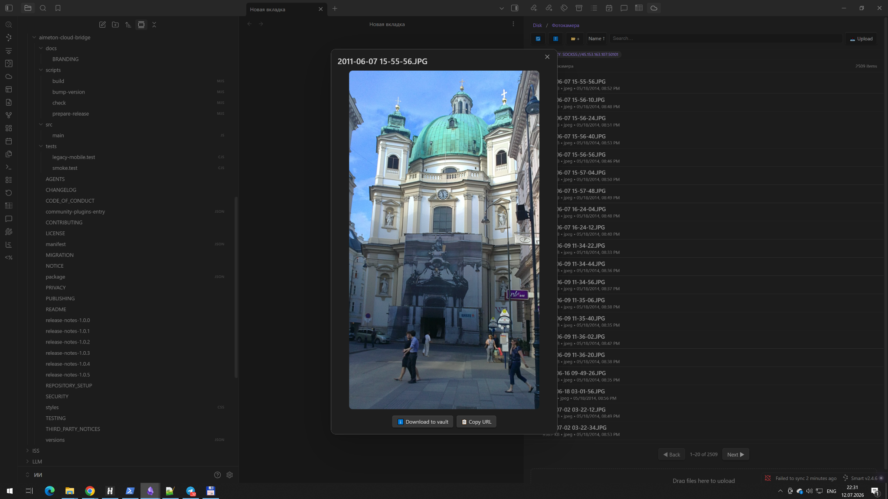
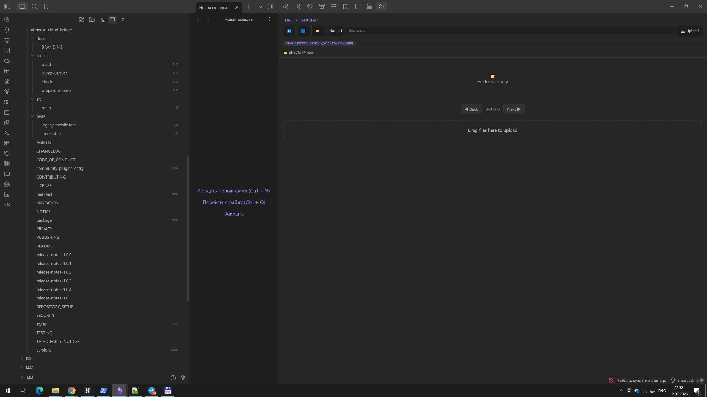

# AIMETON Cloud Bridge

[English](#english) | [Русский](#русский)

<p align="center">
  
</p>

> **Obsidian plugin** for working with **Yandex Disk cloud storage directly from Obsidian**.
>
> Browse cloud folders, upload files from your vault, download files back into the vault, preview images, and use desktop proxy modes — all without leaving Obsidian.

---

## English

### What it is

**AIMETON Cloud Bridge** is a community **plugin for Obsidian** that connects your vault to **Yandex Disk cloud storage**.

It lets you **work with Yandex Disk from inside Obsidian**:

- browse Yandex Disk folders in a dedicated side panel;
- upload local vault files to Yandex Disk;
- download cloud files back into the vault;
- preview supported images;
- monitor upload and download progress;
- use the plugin in Russian or English;
- route desktop traffic through **HTTP CONNECT**, **HTTPS CONNECT**, or **SOCKS5** proxies.

### Why it is useful

If you keep documents, images, archives, or project files in **Yandex Disk**, this plugin gives you a direct bridge between **Obsidian** and the **Yandex Disk cloud**. Instead of switching between apps, you can access cloud files from your knowledge workspace.

### Key features

- **Obsidian-first workflow** for Yandex Disk.
- Dedicated browser panel inside Obsidian.
- Upload and download support.
- Image preview.
- Progress indicators.
- Russian and English UI.
- Light, dark, and system theme compatibility.
- Desktop proxy support: HTTP CONNECT, HTTPS CONNECT, SOCKS5.
- Mobile networking through the system connection, VPN, or TUN.

### Screenshots

#### Image preview inside Obsidian



#### Empty folder view inside Obsidian



### Tested release

Version **1.0.5** is the current release candidate.

Verified scenarios:

- Android: startup, upload, download, image preview, Russian and English UI, dark theme.
- Desktop with system networking: upload, download, preview, Russian and English UI, light, dark, and system themes.
- Desktop with manual proxy: HTTP CONNECT and SOCKS5.
- Error banners can be dismissed and auto-hide.
- Directory listings refresh after delete, create, move, and copy operations.

### Installation from a release

Copy these files from the matching GitHub release into:

```text
<Vault>/.obsidian/plugins/aimeton-cloud-bridge/
```

Required files:

- `main.js`
- `manifest.json`
- `styles.css`

The file path must be exactly:

```text
<Vault>/.obsidian/plugins/aimeton-cloud-bridge/main.js
```

### Authentication and local storage

The plugin uses a **Yandex Disk OAuth token** supplied by the user. In version **1.0.5**, the OAuth token and optional proxy password are stored locally in the plugin's `data.json`. They are not sent to the plugin author.

Do not publish, commit, or share `data.json`. Protect access to the device, vault configuration directory, and user account.

The settings include a collapsible **How to get an OAuth token** guide with links to official Yandex documentation.

### Privacy

The plugin has no author-controlled backend and does not collect analytics or telemetry. See [PRIVACY.md](PRIVACY.md).

### Independence notice

This is an independent community project. It is not affiliated with, endorsed by, sponsored by, or supported by Yandex LLC or Dynalist Inc. See [NOTICE.md](NOTICE.md).

### License and authorship

Created and maintained by **Dimar4713** as part of the AIMETON ecosystem.

Copyright © 2026 **Dmitry Marareskul**.

Licensed under the [MIT License](LICENSE).

---

## Русский

### Что это

**AIMETON Cloud Bridge** — это community-**плагин для Obsidian**, который связывает ваше хранилище заметок с **облачным Яндекс.Диском**.

Он позволяет **работать с Yandex Disk прямо из Obsidian**:

- просматривать папки Яндекс.Диска в отдельной боковой панели;
- загружать файлы из vault на Яндекс.Диск;
- скачивать файлы из облака обратно в vault;
- просматривать изображения;
- видеть ход загрузки и скачивания;
- использовать интерфейс на русском или английском языке;
- на компьютере работать через прокси **HTTP CONNECT**, **HTTPS CONNECT** и **SOCKS5**.

### Зачем нужен плагин

Если ваши документы, изображения, архивы или рабочие файлы лежат в **облаке Yandex Disk**, этот плагин даёт прямой мост между **Obsidian** и **Яндекс.Диском**. То есть работать с облачными файлами можно из вашего рабочего пространства знаний, не переключаясь между приложениями.

### Основные возможности

- **Работа с Яндекс.Диском из Obsidian**.
- Отдельная панель браузера файлов внутри Obsidian.
- Загрузка и скачивание файлов.
- Предпросмотр изображений.
- Индикаторы прогресса.
- Русский и английский интерфейс.
- Совместимость со светлой, тёмной и системной темой.
- Поддержка прокси на компьютере: HTTP CONNECT, HTTPS CONNECT, SOCKS5.
- На мобильных устройствах — работа через системное соединение, VPN или TUN.

### Скриншоты

#### Предпросмотр изображения внутри Obsidian


#### Пустая папка внутри Obsidian


### Протестированная версия

Версия **1.0.5** сейчас является актуальным release candidate.

Подтверждённые сценарии:

- Android: запуск, загрузка, скачивание, предпросмотр изображения, русский и английский интерфейс, тёмная тема.
- Компьютер, системная сеть: загрузка, скачивание, предпросмотр, русский и английский интерфейс, светлая, тёмная и системная темы.
- Компьютер, ручной прокси: HTTP CONNECT и SOCKS5.
- Сообщения об ошибках можно закрыть вручную, и они скрываются автоматически.
- Список файлов корректно обновляется после удаления, создания, перемещения и копирования.

### Установка из релиза

Скопируйте файлы из соответствующего GitHub Release в папку:

```text
<Vault>/.obsidian/plugins/aimeton-cloud-bridge/
```

Обязательные файлы:

- `main.js`
- `manifest.json`
- `styles.css`

Путь должен быть именно таким:

```text
<Vault>/.obsidian/plugins/aimeton-cloud-bridge/main.js
```

### Аутентификация и локальное хранение

Плагин использует **OAuth-токен Яндекс.Диска**, который задаёт сам пользователь. В версии **1.0.5** OAuth-токен и необязательный пароль прокси хранятся локально в файле `data.json` плагина. Автору плагина эти данные не отправляются.

Не публикуйте, не коммитьте и не передавайте файл `data.json`. Защищайте доступ к устройству, каталогу настроек vault и своей учётной записи.

В настройках есть раскрывающаяся подсказка **«Как получить OAuth-токен»** со ссылками на официальную документацию Яндекса.

### Конфиденциальность

Плагин не использует сервер, контролируемый автором, и не собирает аналитику или телеметрию. См. [PRIVACY.md](PRIVACY.md).

### Независимость проекта

Это независимый community-проект. Он не аффилирован с Yandex LLC и Dynalist Inc., не спонсируется и не поддерживается ими. См. [NOTICE.md](NOTICE.md).

### Лицензия и авторство

Создан и поддерживается **Dimar4713** как часть экосистемы AIMETON.

Copyright © 2026 **Dmitry Marareskul**.

Лицензия: [MIT License](LICENSE).
